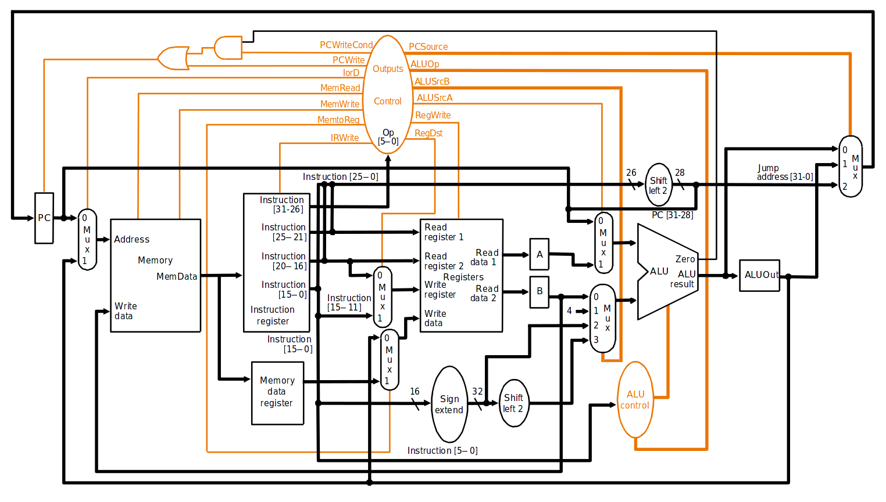

# Mips-cpu

A simple MIPS-like CPU written in SystemVerilog.

## Features

- 32 general purpose registers 
- 32 bit registers
- Big-endian
- Byte addressing
- 256 bytes of memory
- Multi cycle

 
-----

### Supported instructions

**Please note that it currently lacks proper multiplication, division and exception handling.**
__For a better explanation on instructions and what every thing means, have a look [here](https://en.wikibooks.org/wiki/MIPS_Assembly/MIPS_Details)__

#### Type R instructions

| assembly          | opcode | shamt | funct | behavior                    |
|-------------------|--------|-------|-------|-----------------------------|
| add rd, rs, rt    | 0x0    | 0x0   | 0x20  | rd ← rs + rt                |
| addu rd, rs, rt   | 0x0    | 0x0   | 0x21  | rd ← rs + rt *              |
| and rd, rs, rt    | 0x0    | 0x0   | 0x24  | rd ← rs & rt                |
| jr RS             | 0x0    | 0x0   | 0x8   | PC ← rs                     |
| sll rd, rt, shamt | 0x0    | shamt | 0x0   | rd ← rt << shamt            |
| sllv rd, rt, rs   | 0x0    | 0x0   | 0x4   | rd ← rt << rs               |
| slt rd, rs, rt    | 0x0    | 0x0   | 0x2A  | rd ← (rs < rt) ? 1 : 0      |
| sra rd, rt, shamt | 0x0    | shamt | 0x3   | rd ← rt >> shamt **         |
| srav rd, rt, rs   | 0x0    | 0x0   | 0x7   | rd ← rt >> rs **            |
| srl rd, rt, shamt | 0x0    | shamt | 0x2   | rd ← rt >> shamt            |
| sub rd, rs, rt    | 0x0    | 0x0   | 0x22  | rd ← rs - rt                |
| subu rd, rs, rt   | 0x0    | 0x0   | 0x23  | rd ← rs – rt *              |
| xor rd, rs, rt    | 0x0    | 0x0   | 0x26  | rd ← rs ^ rt                |
| break             | 0x0    | 0x0   | 0xD   | stop program execution      |
| nop               | 0x0    | 0x0   | 0x0   | no operation                |
| rte***            | 0x10   | 0x0   | 0x10  | PC ← EPC (exception return) |

`*Those won't overflow`

`**Those ones perform a sign extend`

`***Not properly implemented`

#### Type I instructions

| assembly             | opcode | address/immediate | behavior                          |
|----------------------|--------|-------------------|-----------------------------------|
| addi rt, rs, imm     | 0x8    | Imm               | rt ← rs + imm *                   |
| addiu rt, rs, imm    | 0x9    | Imm               | rt ← rs + imm *                   |
| andi rt, rs, imm     | 0xC    | Imm               | rt ← rs & imm *                   |
| beq rs, rt, offset   | 0x4    | Offset            | PC ← offset if rs==rt             |
| bne rs, rt, offset   | 0x5    | Offset            | PC ← offset if rs!=rt             |
| lbu rt, address (rs) | 0x24   | Address           | rt ← byte [address+(rs) ] **      |
| lhu rt, address (rs) | 0x25   | Address           | rt ← halfword [ address+(rs)] **  |
| lui rt, imm          | 0xF    | Imm               | rt[31..15] ← imm; rt[15..0] ← 0   |
| lw rt, address (rs)  | 0x23   | Address           | rt ← word [ address (rs) ] **     |
| sb rt, address (rs)  | 0x28   | Address           | address (rs) ← byte [ rt ] **     |
| sh rt, address (rs)  | 0x29   | Address           | address (rs) ← halfword [ rt ] ** |
| slti rt, rs, imm     | 0xA    | Imm               | rt ← (rs < imm) ? 1 : 0 *         |
| sw rt, address (rs)  | 0x2B   | Address           | [address+(rs)] ← word [ rt ] **   |
| sxori rt, rs, imm    | 0xE    | Imm               | rt ← rs ^ imm *                   |

`*Imm value should be extended to 32 bits, while also extending it's signal bit (MSB).`

`**address value should be added to the value of rs for the end memory address where data should be written into or read from.`

##### Conditional branches

| assembly          | opcode | rt   | behavior                                                    |
|-------------------|--------|------|-------------------------------------------------------------|
| bgez rs, offset   | 0x01   | 0x01 | if (RS >= 0) then PC = PC + signextend(offset)*4            |
| bgezal rs, offset | 0x01   | 0x11 | if (RS >= 0) then r31= PC; PC = PC + signextend(offset)||00 |
| bgtz rs, offset   | 0x07   | 0x00 | if (RS > 0) then PC = PC + signextend(offset)*4             |
| blez rs, offset   | 0x06   | 0x00 | if (RS<= 0) then PC = PC + signextend(offset)*4             |
| bltz rs, offset   | 0x01   | 0x00 | if (RS < 0) then PC = PC + signextend(offset)*4             |
| bltall rs, offset | 0x01   | 0x12 | if (RS < 0) then r31=PC;  PC = PC + signextend(offset)*4    |

#### Type J instructions

| assembly             | opcode | behavior                                         |
|----------------------|--------|--------------------------------------------------|
| j offset             | 0x2    | PC ← offset                                      |
| jal offset           | 0x3    | PC ← offset, return address is loaded into r31.  |

--------

### Shift register

The shift register should be capable of shifting a 32 bit number left and right. The signal may be preserved or not.

#### Inputs 

- `I` - 32 bit input value
- `n` - 3 bit value that indicates the shift amount.
- `shift` - 3 bit value that indicates the needed operation. Those can be seen in the table bellow.

| shift | behavior               |
|-------|------------------------|
| 000   | Nothing to do          |
| 001   | Load into register     |
| 010   | Left shift             |
| 011   | Logic right shift      |
| 100   | Arithmetic right shift |
| 101   | Right rotation         |
| 110   | Left rotation          |

#### Output

- `S` - the 32 bit value that represents the end result of the chosen operation.

--------

### ALU

A combinational circuit that allows arithmetic between 32 bit numbers, represented as two's complement.

#### Flags

- `Z` - Indicates whether the value is zero.
- `N` - Indicates whether the value is negative.
- `O` - Indicates whether there is an overflow.
- `ET` - Indicates whether the value is equal than.
- `LT` - Indicates whether the value is less than.
- `GT` - Indicates whether the value is greater than.

#### Inputs

- `A` - 32 bit input value
- `B` - 32 bit input value
- `F` - 3 bit function value that indicates the needed operation. Those can be seen in the table bellow.

| function | operation    | description   | flags set  |
|----------|--------------|---------------|------------|
| 000      | S = A        | Loads A       | Z, N       |
| 001      | S = A + B    | Sum           | Z, N, O    |
| 010      | S = A - B    | Subtraction   | Z, N, O    |
| 011      | S = A and B  | Logic AND     | Z          |
| 100      | S = A + 1    | A's increment | Z, N, O    |
| 101      | S = not A    | A's negation  | Z          |
| 110      | S = A xor B  | Exclusive OR  | Z          |
| 111      | S = A comp B | Comparision   | EG, GT, LT |

#### Output

- `S` - the 32 bit value that represents the end result of the chosen operation.